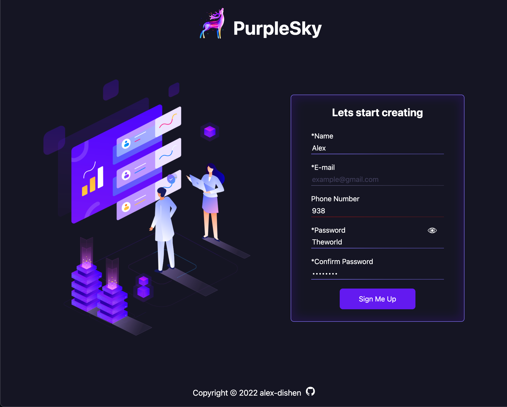

<h2 align="center">Hello, <a href="https://github.com/alex-dishen" 
  title="Profile" target="_blank">I'm Alexander</a>👋</h2>
 

  I'm a 21 years old Frontend Developer. 
  I'm passionate about exploring new technologies which I can leverage
  to solve real-life problems.  
  I LOVE creating awesome websites.  
  And currently looking forward to join an adventurous team!
  
  
  📫 How to reach me:

  

 

<h1 align="center">🔧 Languages & Tools</h1>

<table align="center">
  <tr>
    <td align="center" height="90" width="90">
      
       HTML5
    </td>
    <td align="center" height="90" width="90">
      
       CSS3
    </td>
    <td align="center" height="90" width="90">
      
       JavaScript
    </td>
  </tr>
  <tr>
    <td align="center" height="90" width="90">
      
       React
    </td>
        <td align="center" height="90" width="90">
      
       SASS
    </td>
    <td align="center" height="90" width="90">
      
       Git
    </td>
  </tr>
</table>
 

<h1 align="center">Projects</h1>

The projects don't get updated with
  time and according to my skills.  They preserve their initial form to 
  show my skills at that particular time, and show  my growth from 
  project to project.

<h2 align="center">Newest Projects First</h2>

<table>
  <tr>
    <td width='50%'>
    <h2 align='center'>CV Maker</h2>
      
  
        
         
         
        

          
          
        

        
<strong>SCSS, React</strong>

      
</td>
    <td width="50%">
      <h2 align='center'>Tic Tac Toe</h2>
      
  
        
         
         
        

          
          
        

        
<strong>HTML, CSS, JavaScript</strong>

      

    </td>
  </tr>
  <tr>
    <td width='50%'>
      <h2 align='center'>Library</h2>
      
  
        
         
         
        

          
          
        

        
<strong>HTML, CSS, JavaScript</strong>

      

    </td>
    <td width="50%">
      <h2 align="center">Admin Dashboard</h2>
      
  
        
         
         
        

          
          
        

        
<strong>HTML, CSS</strong>

      

    </td>
  </tr>
  <tr>
    <td width="50%">
      <h2 align="center">Sign-up Form</h2>
      
  
        
         
         
        

          
          
        

        
<strong>HTML, CSS, JavaScript</strong>

      

    </td>    
    <td width="50%">
      <h2 align="center">Calculator</h2>
      
  
        
         
         
        

          
          
        

        
<strong>HTML, CSS, JavaScript</strong>

      

    </td>
  </tr>
  <tr>
    <td width="50%">
      <h2 align="center">Etch-a-Sketch</h2>
      
  
        
         
         
        

          
          
        

        
<strong>HTML, CSS, JavaScript</strong>

      

    </td>
    <td width="50%">
      <h2 align="center">Rock Paper Scissors</h2>
      
  
        
         
         
        

          
          
        

        
<strong>HTML, CSS, JavaScript</strong>

      

    </td>
  </tr>
  <tr>
    <td width="50%">
      <h2 align="center">Landing page</h2>
      
  
        
         
         
        

          
          
        

        
<strong>HTML, CSS</strong>

      

    </td>
    <td width="50%">
      <h2 align="center">Recipes</h2>
      
  
        
         
         
        

          
          
        

        
<strong>HTML</strong>

      

    </td>
  </tr>
</table>