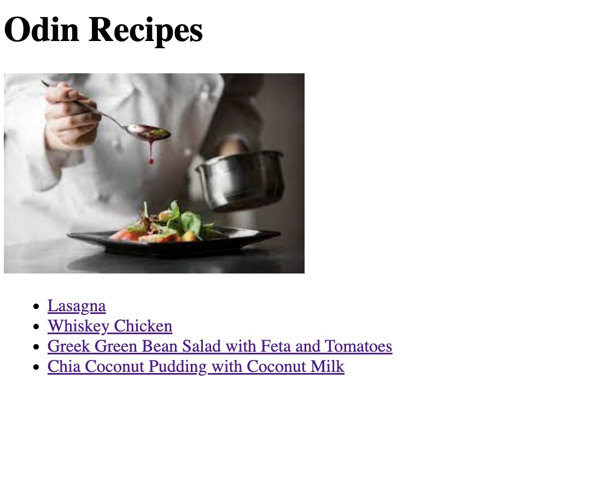

<h2 align="center">Hello, <a href="https://github.com/alex-dishen" 
  title="Profile">I'm Alexander</a>👋</h2>
 

  I'm a 21 years old Frontend Developer based in Ukraine. 
  I enjoy being given challenging, visually-pleasing designs and making them a reality.  
  The thing that excites me, and gets me pumped up  
  is the process of tearing an idea down into its smallest components,   
  learning, and figuring out how to put those pieces together 
  while creating something really awesome.
  
  
  📫 How to reach me:

  

 

<h1 align="center">🔧 Languages & Tools</h1>

<table align="center">
  <tr>
    <td align="center" height="90" width="90">
      
       HTML5
    </td>
    <td align="center" height="90" width="90">
      
       CSS3
    </td>
    <td align="center" height="90" width="90">
      
       JavaScript
    </td>
    <td align="center" height="90" width="90">
      
       TypeScript
    </td>
    <td align="center" height="90" width="90">
      
       React
    </td>
    <td align="center" height="90" width="90">
      
       Redux
    </td>
  </tr>
  <tr>
    <td align="center" height="90" width="90">
      
       GraphQL
    </td>
    <td align="center" height="90" width="90">
      
       Styled Components
    </td>
    <td align="center" height="90" width="90">
      
       SASS
    </td>
    <td align="center" height="90" width="90">
      
       Firebase
    </td>
    <td align="center" height="90" width="90">
      
       NPM
    </td>
    <td align="center" height="90" width="90">
      
       Git
    </td>
  </tr>
</table>
 

<h1 align="center">Projects</h1>

The projects don't get updated after they were finished.  They preserve their initial form to 
  show my skills at that particular time,  and show my growth from 
  project to project.

<h2 align="center">Newest Projects First</h2>

<table>
  <tr>
    <td width='50%'>
      <h2 align='center'>Shop</h2>
      
  
        
         
         
        

          
          
        

        
<strong>React, TypeScript Redux, GraphQL</strong>

      
</td>
    <td width='50%'>
      <h2 align='center'>Currency Converter</h2>
      
  
        
         
         
        

          
          
        

        
<strong>Angular, TypeScript, SCSS</strong>

      

    </td>
  </tr>
  <tr>
    <td width='50%'>
      <h2 align='center'>To-Do</h2>
      
  
        
         
         
        

          
          
        

        
<strong>React, Redux, StyledComponents</strong>

      

    </td>
    <td width='50%'>
      <h2 align='center'>Memory Card</h2>
      
  
        
         
         
        

          
          
        

        
<strong>React, SCSS</strong>

      

    </td>
  </tr>
  <tr>
    <td width='50%'>
    <h2 align='center'>CV Maker</h2>
      
  
        
         
         
        

          
          
        

        
<strong>React, SCSS</strong>

      
</td>
    <td width='50%'>
      <h2 align='center'>Tic Tac Toe</h2>
      
  
        
         
         
        

          
          
        

        
<strong>HTML, CSS, JavaScript</strong>

      

    </td>
  </tr>
  <tr>
    <td width='50%'>
      <h2 align='center'>Library</h2>
      
  
        
         
         
        

          
          
        

        
<strong>HTML, CSS, JavaScript</strong>

      

    </td>
    <td width='50%'>
      <h2 align="center">Admin Dashboard</h2>
      
  
        
         
         
        

          
          
        

        
<strong>HTML, CSS</strong>

      

    </td>
  </tr>
  <tr>
    <td width='50%'>
      <h2 align="center">Sign-up Form</h2>
      
  
        
         
         
        

          
          
        

        
<strong>HTML, CSS, JavaScript</strong>

      

    </td>    
    <td width='50%'>
      <h2 align="center">Calculator</h2>
      
  
        
         
         
        

          
          
        

        
<strong>HTML, CSS, JavaScript</strong>

      

    </td>
  </tr>
  <tr>
    <td width='50%'>
      <h2 align="center">Etch-a-Sketch</h2>
      
  
        
         
         
        

          
          
        

        
<strong>HTML, CSS, JavaScript</strong>

      

    </td>
    <td width='50%'>
      <h2 align="center">Rock Paper Scissors</h2>
      
  
        
         
         
        

          
          
        

        
<strong>HTML, CSS, JavaScript</strong>

      

    </td>
  </tr>
  <tr>
    <td width='50%'>
      <h2 align="center">Landing page</h2>
      
  
        
         
         
        

          
          
        

        
<strong>HTML, CSS</strong>

      

    </td>
    <td width='50%'>
      <h2 align="center">Recipes</h2>
      
  
        
         
         
        

          
          
        

        
<strong>HTML</strong>

      

    </td>
  </tr>
</table>